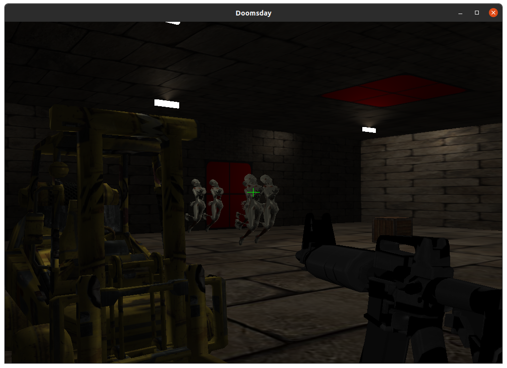

[](https://www.cplusplus.com/)

# Doomsday

Project implemented for Computer graphics course.

## Prerequisites

```
$ sudo apt install g++ cmake git build-essential libgl1-mesa-dev libsoil-dev libglm-dev libassimp-dev libglew-dev libglfw3-dev libxinerama-dev libxcursor-dev libxi-dev mesa-common-dev mesa-utils libxxf86vm-dev libfreetype6-dev
```

CMAKE: <https://cmake.org/>

CLION: <https://www.jetbrains.com/clion/>

## 🔨 Building

Preferred way of building our project is through the Clion IDE, you just need to clone this repository first:
```shell
git clone https://github.com/ArthasWasRight/Doomsday.git
```

Then position to the directory you just made and open Clion in it:
```shell
cd Doomsday
clion .
```

Clion should automatically load CMakeLists.txt and you are good to go! If you have any troubles, feel free to contact us.

## 🖥️ Screenshot


#### Authors
-   **Viktor Gizdavić**
-   **Lazar Lukić**
